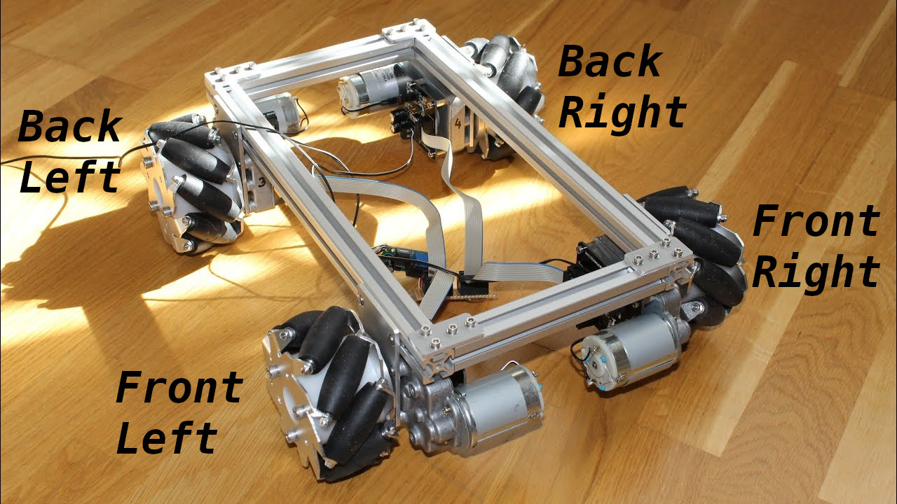

# Mecanum

## What are mecanum wheels?

[GM0](https://gm0.org/en/latest/docs/robot-design/drivetrains/holonomic.html#mecanum-drive)

Mecanum drivetrains consist of four mecanum wheels which are powered independently by one motor. This configuration angles the velocity of each wheel, allowing the robot to strafe.

The primary advantage to mecanum drive is the maneuverability it affords, especially because the robot can strafe instead of turn and drive. The rollers on mecanum wheels form a 45 degree angle with the wheel’s axis of rotation, which means that mecanum drivetrains can’t strafe as fast as they can drive forward.


## How do I use mecanum wheels with FTC Layer?

Easy!

First you must include FTC Layer's Mecanum class

At the top of your file, add the following line.
```java
import org.ftc17191.ftclayer.drivetrain.mecanum.Mecanum;
```

Then we have to make a variable that controls the mecanum wheels. We will
use the ids we set to our drive motors when making this variable.

```java
Mecanum mecanum = new Mecanum(hardwareMap, "front_right", "front_left", "back_right", "back_left");
```
Use this reference image to see which motors need to be set to which.


> Don't know how to set a configuration? 
 [Click Here.](https://docs.revrobotics.com/rev-conthttps://docs.revrobotics.com/rev-control-systehttps://docs.revrobotics.com/rev-control-systehttps://docs.revrobotics.com/rev-control-systehttps://docs.revrobotics.com/rev-control-system/programming/hello-robot-configurationm/programming/hello-robot-configurationm/programming/hello-robot-configurationm/programming/hello-robot-configurationrol-system/programming/hello-robot-configuration)


Now to drive the robot!

In your code, there is a place where it will loop constantly. 

It may be inside of:

```java
while(opModeIsActive())
{

}
```

Or inside of:

```java
@Override
void loop()
{

}
```

Inside of whichever your code uses you need to place the line:
```java            
                //  Forward                Strafe                 Turn
mecanum.powerDrive(gamepad1.left_stick_y, gamepad1.left_stick_x, gamepad1.right_stick_x);
```

## What if its reversed?
Due to how your mecanum train may be built, some controls may be reversed, if something is reversed, 
then add a subtraction sign before what control is reversed.

Like so:
```java            
// This example shows if forward is reversed, since forward is reversed, i will add a - before the forward control

                //  Forward                Strafe                 Turn
mecanum.powerDrive(-gamepad1.left_stick_y, gamepad1.left_stick_x, gamepad1.right_stick_x);
```

## Full code
This uses everything said above.

```java
package org.firstinspires.ftc.teamcode.driverop;

import com.qualcomm.robotcore.eventloop.opmode.LinearOpMode;

import org.ftc17191.ftclayer.drivetrain.mecanum.Mecanum;

public class CodeExample extends LinearOpMode
{
    Mecanum mecanum = new Mecanum(hardwareMap,
            "front_right",
             "front_left",
            "back_right",
             "back_left");
    @Override
    public void runOpMode(){

        while (opModeIsActive())
        {
            mecanum.powerDrive(gamepad1.left_stick_y,
                    gamepad1.left_stick_x,
                    gamepad1.right_stick_x);
        }
    }
}
```